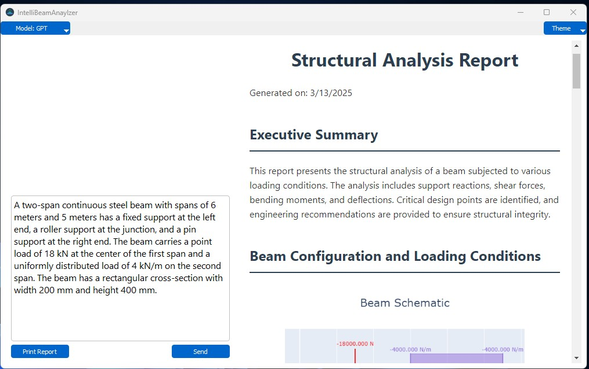

# Assessment of the Potential of Emerging Large Laguage Models for Structural Annalysis

## OverView

This framework is designed to assess the capabilities of emerging Large Language Models (LLMs), such as GPT-4, in performing structural analysis of beams. The goal is to determine the accuracy and robustness of  LLMs in structural analysis of beams in an agent based framework and their  ability to make sense of results to generate quality(fit for purpose) structural analysis reports.

## Framework Components

The framework consists of 7 major components: a User Interface; Task Packager; Model Interface; Utility Tools; Response Retriever; Instruction Runner and a PDF Generator.  

The <b>User Interface</b> provides an input area, where the user can enter the beam analysis task. It also provides an area where the generated output will be displayed, a drop-down button to enable the user select which Large Language Model they want to solve the task and an option to interchange between themes.

The <b>Task Packager</b> retrieves the task from the input area, and aggregates it with the system prompt. The system prompt is a sequence of characters that inform the LLM of its role. In this case the system prompt informs the LLM that it's a structural analysis engineer. The Task packager also removes unnecessary character sequences such as redundant spaces, new line characters to minimize tokens so as to reduce costs.

The <b>Model Interface</b> is an abstraction that provides two functions: one to send the task to the LLM and the other to receive the response from the LLM. We take advantage of the abstraction principle of object-oriented programming by having two separate classes that implement the Model Interface. This is to ensure LLM agonism of the framework. This means the framework can support other LLMs apart from GPT e, for example to support Gemini, all we would have to do is to have a class that implements the model interface abstract class using Gemini API. The model interface has access to Utility Tools such as unit convertor and a materials database.

The <b>Response Retriever</b> gets the response of the LLM and parses it to retrieve either the instructions that solve the task or the report details. The <b>Instruction Runner</b> executes the task solution, while the PDF Generator uses the report details to generate a printable report as specified by the LLM.

Labels A, B, C, D, E, F, G in figure above represent the events that lead to calling of a given component of the framework. Event A occurs when the user clicks the send button of the User Interface after entering a task in the input area. Event E, occurs when the Instruction Runner has completed execution of the LLM solution to the task. It then delivers the solution (support reactions, shear and bending moment along the beam length) to the Task Packager.

Event B; submission of the task to the Model Interface occurs after either event A or E. The nature of the task submitted depends on which of the events A or E has occurred. If event A has occurred, the task submitted requests the structural engineer (LLM) to generate instructions that solve the task, otherwise the request is to write the structural analysis report.

Event C occurs after the Model Interface (Structural Engineer) has generated a response. Depending on the task, the response can be a task solution instruction leading to triggering of event D, or structural analysis report details, triggering event F. The structural analysis details are expected in html format. Event G is triggered after the PDF Generator has parsed the html report. This event causes a printable report to be displayed in the report display area of the user interface.

  
## Contributors

- [Ssegawa Patrick](https://github.com/pscholar) - Research & Development
- Orris Ceaser - Research & Development

## Credits

Some classes in the utility interface leverage functionality from <b>IndeterminateBeam</b> by Jesse Bonanno. You can access it at:  

[👉 IndeterminateBeam GitHub Repository](https://github.com/JesseBonanno/IndeterminateBeam)

## License

This project is licensed under the **MIT License**. See [LICENSE](LICENSE) for details.
